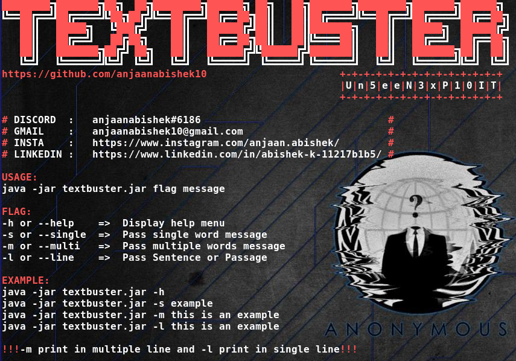
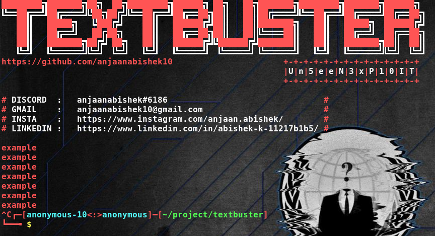
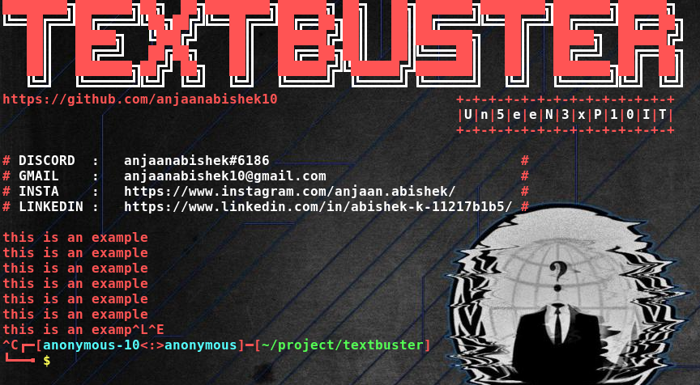
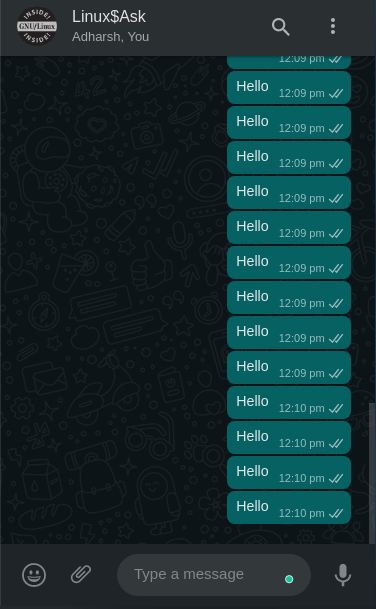

# Textbuster

Repeatedly Fill any Text Field with the Message 0r Word you type.

Any Online or Offline, if a Field Requires you to enter Text then use this to Fill it Automatically and Repeatedly.

Means this can be used as Message Buster, Auto Messenger in all messaging platform.

NOTE: Uploaded only the Executable jar File, for Source Code, Text me through Mail,Discord, LinkedIn or Insta

[][mail]
[][linkedin]
[][instagram]
[][facebook]
 anjaanabishek#6186

<h2> Get Started: </h2>

!!!Below Method is for both Windows and Linux!!!

!!!Bofore Getting Started Make sure JAVA is Installed in your Machine!!!

* git clone https://github.com/anjaanabishek10/Textbuster.git

* cd Textbuster

<h2> Usage: </h2>

<h3> => java -jar textbuster.jar -h </h3>

<h3> => java -jar textbuster.jar -s example </h3>

<h3> => java -jar textbuster.jar -m this is an example </h3>

<h3> => java -jar textbuster.jar -l this is an example </h3>

<h2> How to Use: </h2>

* Run the jar file

* Go click on any text field online or offline

* See the Magic

<h2> Lets use on WhatsApp: </h2>

* Run java -jar textbuster.jar -s Hello

* Go to https://web.whatsapp.com/

* Click on any Contact

* Click on 'Type a message' field

* See the Magic

[mail]: mailto:anjaanabishek10@gmail.com
[linkedin]: https://www.linkedin.com/in/abishek-k-11217b1b5/
[instagram]: https://www.instagram.com/anjaan.abishek/
[facebook]: https://www.facebook.com/anjaan.abishek.10/
